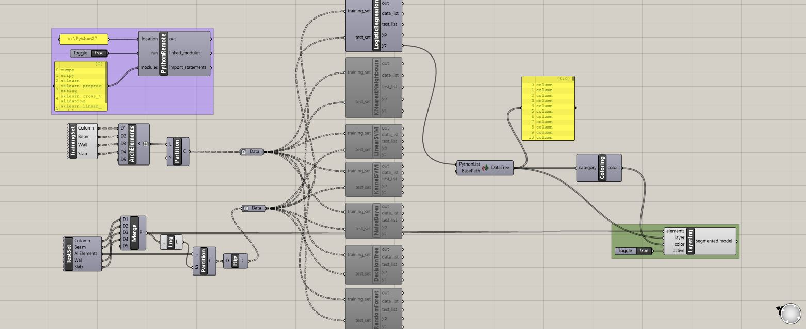

# Layering architectural elements in a 3D model with Supervised Learning in Grasshopper and Rhinoceros

Architectural elements of a 3D model are layered and labelled automatically by using different supervised learning algorithms in Grasshopper and Rhinoceros environments. 

## Citation

This implementation was introduced by "Yetis G, Yetkin O., Moon K. and Kilic, O." in eCAADe Conference-2018 in Lodz, Poland. Please visit http://papers.cumincad.org/data/works/att/ecaade2018_200.pdf for the details. 

## Prerequisites

Rhinoceros v.5/v.6

IronPython >= 2.7.5

GHPython

GHPython Remote (for installation: https://github.com/Digital-Structures/ghpythonremote)
